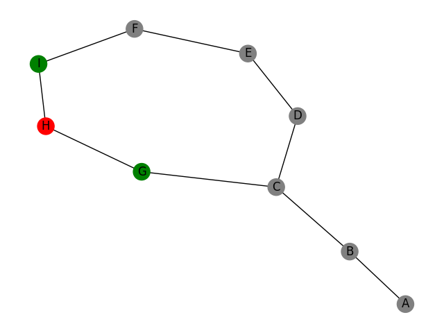
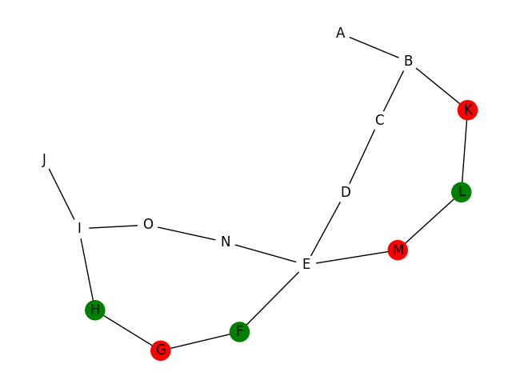
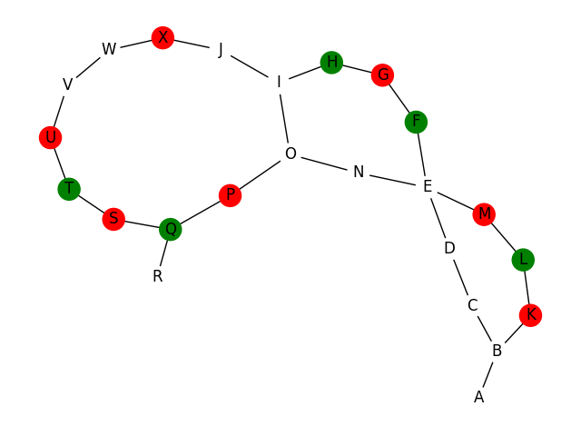
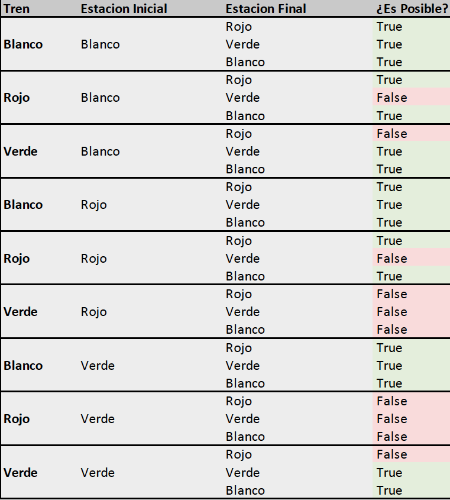

# Tarea Buda.com - Metro
### Ana Undurraga D.
En el caso de que exista, obtiene la ruta más corta entre dos estaciones de una red de metro.

## Consideraciones Generales 

Primero, se le pide al usuario que ingrese un test. Este debe estar guardado en la carpeta tests y se debe ingrerar su nombre incluyendo el .txt .
Se prepararon tres tests; easy.txt, medium.txt y hard.txt, estos se encuentran en la carpeta tests. Estos siguien el formato:

```E,C:E2```

Donde E es la estación inicial, y E2 es uno de sus vecinos.
Por otro lado, C es el color de esta que puede ser G para Green, R para Red y N para el caso en que las estaciones no tienen color.

Así una estación puede estar varias veces en el archivo, según a cuantas estaciones se conecte. 

Para el caso **_easy_** se utilizó el grafo del enunciado:



Para el caso **_medium_** se utilizó el siguiente grafo:



Para el caso **_hard_** se utilizó el siguiente grafo:



### Supuestos 
- Por temas de simplicidad se definieron tres colores para las estaciones y los trenes; **red**,  **green**  y **white** en el caso de que la estación no tenga color.
- Se asumió que los trenes exprés funcionan en cierto horario al igual que en el Metro de Santiago, por lo que se consideró que si el tren es blanco, ya no se está en horario exprés y los trenes blancos pueden detenerse  en todas las estaciones.
- Así, se consideraron los siguientes casos:



## Ejecución :computer:

El módulo principal de la tarea a ejecutar es  ```main.py```
### Archivos
1. ```main.py``` Módulo principal en el cuál se piden los inputs al usuario y se llama a las distintas funciones.
2. ```classes.py``` Contiene las clases Station y  Metro, las cuales son la base del programa.
3. ```functions.py``` Contiene la función _define_train_color()_ que determina las estaciones en las que se puede detener cada tren.

## Librerías :books:
### Librerías externas utilizadas
La lista de librerías externas que utilicé fue la siguiente:

1. ```networkx``` 
2. ```matplotlib```

Estas fueron utilizadas para graficar la red.

## Referencias de código externo :book:
Para realizar mi tarea saqué código de:
1. https://www.python-course.eu/networkx.php): 
Este gráfica la red de Metro. Está implementado en el archivo ```classes.py```  en la función _print_graph()_ de la clase Metro.# Tarea-Metro
